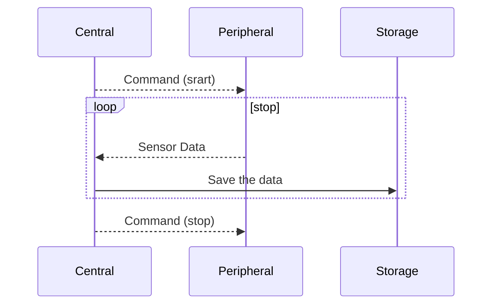

# bal-ble
Bluetooth Low energy serial commnunication scripts for balloon experiments
This repository provides an example that a peripheral device (nRF52840) send thier sensor data to a central (Linux) device.

## Concept
For (balloon) experiment, it is sometimes hard to wire directory sensor devices into logger device.
Here, cheap bluetooth module helps to send the the data with BLE protocol.
This example also supports simple commands for the sensor devices.



## Tested hardwares

  - Peripheral : Xiao BLE nRF52840
  - Central : Raspberry Pi

Any nRF5x device can be used for the peripheral device. 
The Xiao BLE nRF52840 is a very small and inexpensive device, it is suit for the experiment.
The device also has a I2C and SPI ports. Users are able to enhance the usage for their own purposes.

## Prerequirement

Install [bleak](https://github.com/hbldh/bleak) and its prerequirements for your central device.


## Compile & Write

On your demands, edit the script `peripheral/peripheral.ino` to read and write your sensor values.
Compile and write the file into the nRF52840 board with the following command or like this.
```
arduino-cli compile --fqbn Seeeduino:nrf52:xiaonRF52840 peripheral.ino && arduino-cli upload -p /dev/cu.usbmodem2101 --fqbn Seeeduino:nrf52:xiaonRF52840 peripheral.ino
```
Arduino IDE also helps to write the source code.

## Pairing and start the measurement
User don't need to pair the device before executing the script `central/central.py`.
When the device waits the paring, their (blue) LED will be blinked.
The script automatically finds the device, then open command terminal if you don't edit to remove the function in the script.
Then, type `start` to start to save the data.

## Edit the scripts on your demands
This example always write the same strings but in an actual case, we need the real sensor value. 
That is a users' responsibility.

