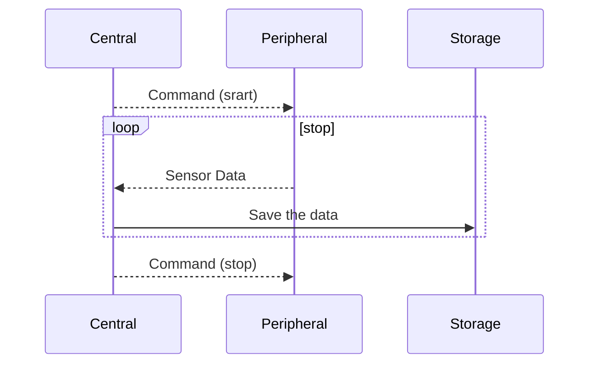

# bal-ble
Bluetooth serial commnunication scripts for balloon experiments

## Concept




## Tested hardware

Xiao BLE nRF52840

Raspberry Pi


## Prerequirement


## Compile & Write

On your demands, edit the script `peripheral/peripheral.ino` to read and write your sensor values.
Compile and write the file into the nRF52840 board with the following command or like this.
```
arduino-cli compile --fqbn Seeeduino:nrf52:xiaonRF52840 peripheral.ino && arduino-cli upload -p /dev/cu.usbmodem2101 --fqbn Seeeduino:nrf52:xiaonRF52840 peripheral.ino
```
Arduino IDE also helps to write the source code.

## Pairing and start the measurement
User don't need to pair the device before executing the script `central/central.py`.
When the device waits the paring, their LED will be blinked.
The script automatically finds the device, then open command terminal.
```
```
